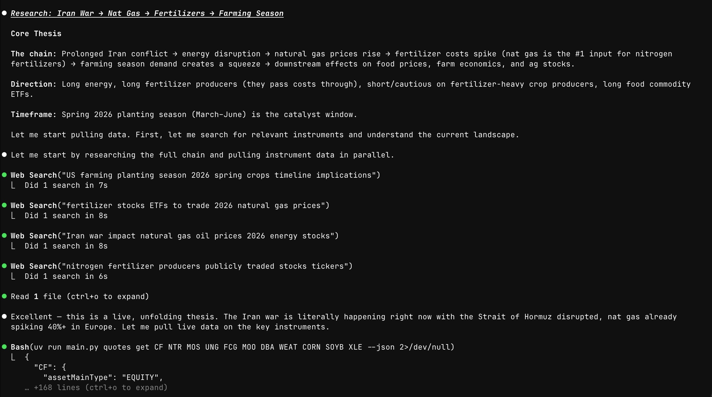

# claude-street

I had a few ideas I wanted to act on, but I didn't really know what financial instruments existed for them, what their prices actually meant, or how they worked. So I got together with Claude late one night and made this!

This repo contains a Python cli that wraps the Schwab API, and lets me investigate and trade my ideas with Claude Code. It has the following commands:

1. `/research` to research a thesis: it can take in a url to a website, a file path to a markdown file, or a free form text and figure out what financial instruments are relevant to the thesis
2. `/trade` to execute and record a trade
3. Management commands: `/portfolio`, `/accounts`, `/orders`, `/transactions`, `/quotes`, `/instruments`, and more (just ask your Claude Code to explain what each command does!)

imo, Claude Code is the perfect form factor for this because it can search the web, research & pull in live data for all relevant instruments, write code to analyze/explain it, and then place the trade when you're ready!



## Setup

Requires Python 3.13+ and [uv](https://docs.astral.sh/uv/). You'll also need a free [Schwab Developer Portal](https://developer.schwab.com/) account.

```bash
git clone https://github.com/sarhaan77/claude-street.git
cd claude-street
uv sync
cp .env.example .env
# fill in your Schwab app key and secret in .env
```

## Auth

```bash
uv run main.py auth login     # opens browser, paste callback URL
uv run main.py auth status    # check token status
uv run main.py auth refresh   # refresh expired access token
```

Tokens stored at `~/.claude-street/tokens.json`. Access tokens expire in 30 min, refresh tokens in 7 days.
API specs and docs sourced from the [Schwab Developer Portal](https://developer.schwab.com/) and live in `docs/`.
